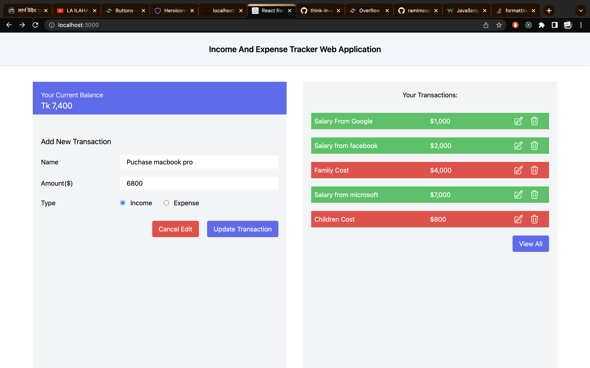
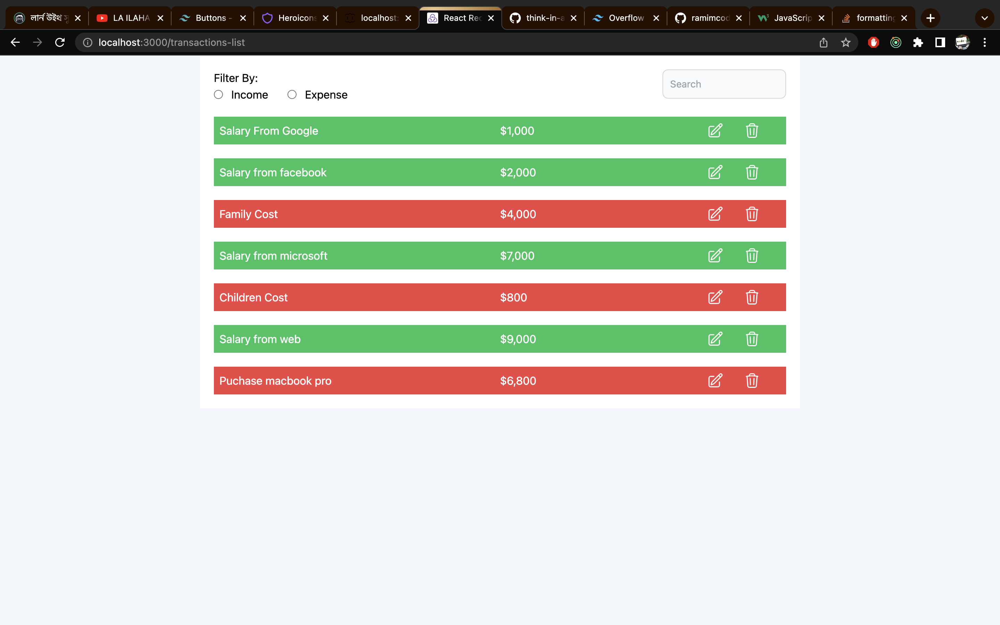

# Build income and expense transactions application

## I have an used:
<ul>
  <li>React</li>
   <li>Redux Toolkit</li>
   <li>axios</li>
    <li>tailwindcss</li>
     <li>json-server</li>
</ul>

## Features
<ul>
  <li>All Transactions get from json-server</li>
   <li>Transaction Create</li>
    <li>Transaction Update</li>
     <li>Transaction Delete</li>
</ul>

## screenshot

 

